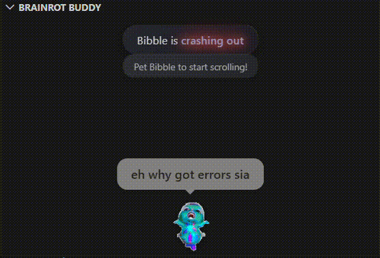
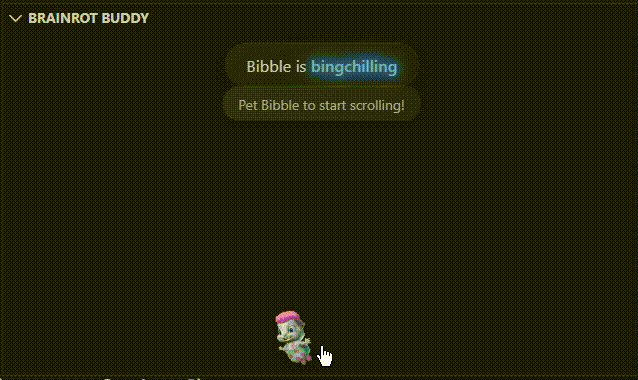
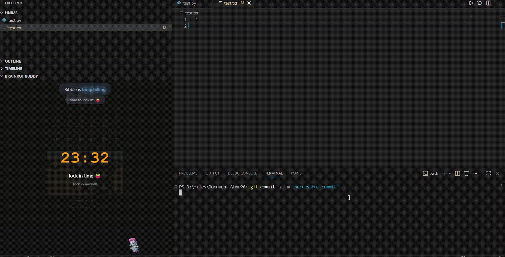

<div align='center'>

# brainrot buddy


</div>

<p align="center">
    your friendly, encouraging and brainrotted coding companion
</p>

<br>

## Installation & Usage

1. Ensure the latest version of [Node.js](https://nodejs.org/en/download/) is installed on your machine.

2. Install Yeoman and the VS Code Extension Generator globally using npm:

    ```bash
    npm install --global yo generator-code
    ```

3. Clone the repository

    ```bash
    git clone https://www.github.com/elphabetsoop/brainrot-buddy
    ```

4. Open the project directory in VS Code

    ```bash
    cd brainrot-buddy
    code .
    ```

5. Install the dependencies

    ```bash
    npm install
    ```

6. Press `F5` to open a new VS Code window with the extension loaded. You should see a heart icon in the activity bar on the left. Drag it to your desired location.


## Inspiration

Inspired by vscode-pets, we wanted a VSCode pet that was #relatable, like [Bibble](https://www.google.com/search?q=bibble). At the same time, we wanted a coding companion that was **encouraging**, **entertaining** and **engaging**, which led us to develop **brainrot buddy**.

## What it does

1. **brainrot buddy** is a VSCode extension that loads a pet (Bibble). Bibble reacts according to the user's workspace state, such as:
    - Errors
    - Successful commits
    - Bad coding practices
    - Regular scheduled programming
2. An **encouraging animation** is also generated upon successful commits. 
3. A **Pomodoro Brainrot Doomscroll panel**, which allows the user to doomscroll during Pomodoro breaks, reducing the need to navigate to other devices/tabs. For peak efficiency (bumness).

## How we built it

- VSCode
- Node.js
- TypeScript

## Challenges we ran into

- With no prior experience with building VSCode extensions and its API, we spent a fair bit of time scouring the documentation for an API that suited our needs
- eepys

## Accomplishments that we're proud of

- **Our first VSCode extension**: It's fun, entertaining, and doesn't break
- **Staying up till 4am**: No easy feat, pulled through sheer willpower and caffeine

## What we learned

We learnt how to create a VSCode extension, experimenting with VSCode extension APIs, WebViews and WebPanels. Most importantly, we learnt how to bring silly ideas to life.

## What's next for brainrot buddy

- Integration with Instagram Reels and Tiktok, for the peak doomscroll experience
- An API to update success animations, because staying trendy is important

## Screenshots

1. Bibble can be rather savage :(
    

2. Bibble serving you dopamine hits but preventing excessive doomscrolling
    

3. Bibble celebrating your success with you!
    