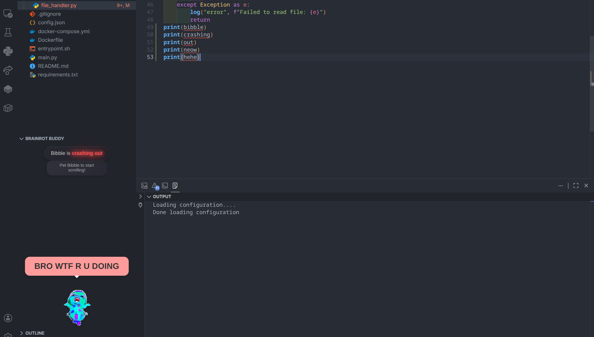
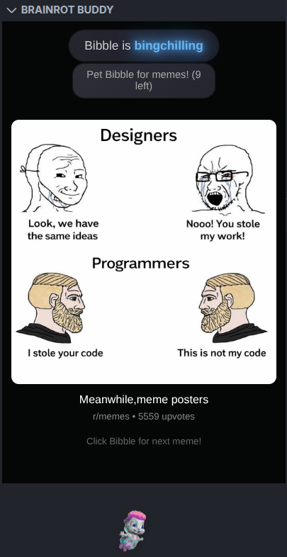
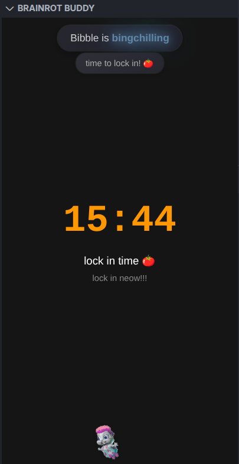

<div align='center'>

# brainrot buddy


</div>

<p align="center">
    your friendly, encouraging and brainrotted coding companion
</p>

<br>

## Installation & Usage

1. Ensure the latest version of [Node.js](https://nodejs.org/en/download/) is installed on your machine.

2. Install Yeoman and the VS Code Extension Generator globally using npm:

    ```bash
    npm install --global yo generator-code
    ```

3. Clone the repository

    ```bash
    git clone https://www.github.com/elphabetsoop/brainrot-buddy
    ```

4. Open the project directory in VS Code

    ```bash
    cd brainrot-buddy
    code .
    ```

5. Install the dependencies

    ```bash
    npm install
    ```

6. Press `F5` to open a new VS Code window with the extension loaded. You should see a heart icon in the activity bar on the left. Drag it to your desired location.

## Features

1. **Bibble**: Your personal VS Code pet that is as brainrotted as you are.
2. **Dopamine Hits**: Bibble serves memes to you: a  dopamine hit to keep you entertained while coding.
3. **Pomodoro Timer**: A built-in Pomodoro timer to prevent you from doomscrolling for too long, and to keep you productive.
4. **Error Roasts**: When you encounter errors, Bibble roasts you based on the number of errors you've made, helping you learn from your mistakes with a touch of humor.

## Screenshots

1. Bibble can be rather savage :(
    

2. Bibble serving you dopamine hits
    

3. Bibble forcing you to LOCK IN
